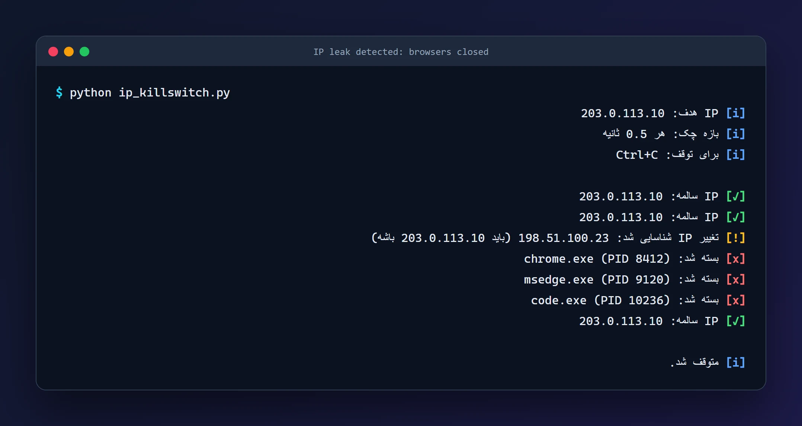
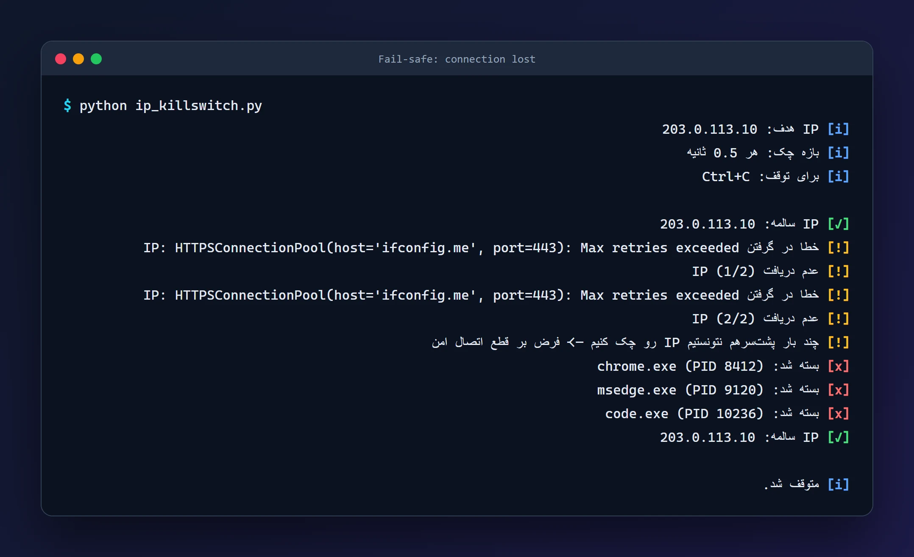
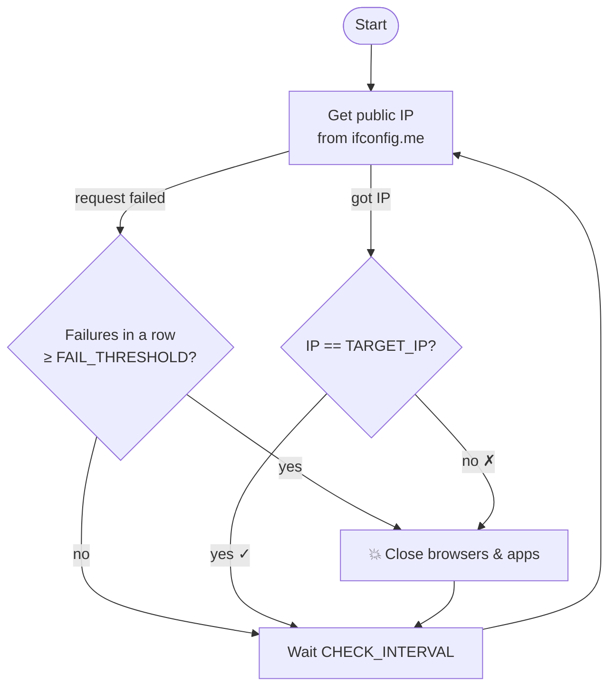

<div align="center">

# 🛡️ IP Kill-Switch

**A lightweight Python watchdog that closes your browsers the moment your VPN or proxy drops, before your real IP can leak.**


<br>



</div>

---

## 📌 Why?

VPN and proxy connections drop silently. When that happens, every open browser tab keeps working over your **real** connection, and your real IP leaks to every site you have open.

IP Kill-Switch watches your public IP continuously. As soon as it no longer matches the IP you expect (your VPN/proxy exit IP), it **force-closes your browsers and other chosen apps** so nothing keeps talking to the internet over the unprotected connection.

## ✨ Features

- 🔁 **Continuous monitoring**: checks your public IP every 0.5 s by default
- 🎯 **Target-IP matching**: anything other than your expected VPN/proxy IP is treated as a leak
- 💥 **Instant shutdown** of Chrome, Edge, Firefox, Brave, Opera, Vivaldi, IE and VS Code (configurable)
- 🧯 **Fail-safe by design**: if the IP can't be checked repeatedly (e.g. the connection dropped), it assumes the worst and closes the apps
- 🪶 **Zero setup**: a single script with two dependencies; no service, driver or admin install
- ⚙️ **Easy configuration**: every setting is a constant at the top of the file

## 🖥️ Demo

<table>
  <tr>
    <td width="50%"><b>VPN dropped: IP changed</b><br></td>
    <td width="50%"><b>Connection lost: fail-safe kicks in</b><br></td>
  </tr>
</table>

<sub>Captured from the real script running against a scripted network scenario (documentation IPs from RFC 5737; no processes were actually closed). The console messages are in Persian.</sub>

## ⚙️ How it works



## 🚀 Getting started

### Requirements

- Python **3.10+**
- Windows (process names use the `.exe` suffix; see [Notes](#-notes) for Linux/macOS)

### Install & run

```bash
git clone https://github.com/erfanmohammadi1998/ip_killswitch.git
cd ip_killswitch
pip install -r requirements.txt
```

Set `TARGET_IP` to your VPN/proxy exit IP (see below), connect to your VPN, then:

```bash
python ip_killswitch.py
```

Stop it any time with `Ctrl+C`.

> 💡 To find your VPN exit IP, connect to the VPN and open [ifconfig.me](https://ifconfig.me).

## 🔧 Configuration

All settings live at the top of [`ip_killswitch.py`](ip_killswitch.py):

| Setting | Description | Default |
|---|---|---|
| `TARGET_IP` | The public IP you expect while protected (your VPN/proxy exit IP) | *set your own* |
| `CHECK_INTERVAL` | Seconds between checks | `0.5` |
| `IP_CHECK_URL` | Service that returns your public IP as plain text | `https://ifconfig.me/ip` |
| `REQUEST_TIMEOUT` | Timeout for each IP check (seconds) | `5` |
| `FAIL_THRESHOLD` | Consecutive failed checks before apps are closed | `2` |
| `BROWSER_PROCESS_NAMES` | Processes to close on a leak (case-insensitive) | common browsers + VS Code |

Add any other app to the kill list:

```python
BROWSER_PROCESS_NAMES = [
    "chrome.exe",
    "msedge.exe",
    "firefox.exe",
    "Code.exe",
    "Telegram.exe",   # your own additions
]
```

## 📝 Notes

- This tool works at the **application level**: it closes apps but doesn't block traffic. For maximum protection, combine it with your VPN client's built-in kill switch or Windows Firewall rules.
- Closing elevated processes may require running the script **as Administrator**.
- On **Linux/macOS**, use process names without `.exe` (e.g. `chrome`, `firefox`, `code`).
- The script depends on an external IP-lookup service; if it's unreachable, the fail-safe closes your apps by design.

## 🗺️ Roadmap

- [ ] Command-line arguments / config file instead of editing constants
- [ ] Optional firewall-level blocking
- [ ] Desktop notification when a leak is detected
- [ ] Cross-platform process names out of the box

## 📄 License

Released under the [MIT License](LICENSE).

## 👨‍💻 Author

**Erfan Mohammadi**

[](https://erfanmohammadi.ir/)
[](https://www.linkedin.com/in/erfan-mohammadi77/)
[](https://github.com/erfanmohammadi1998)
